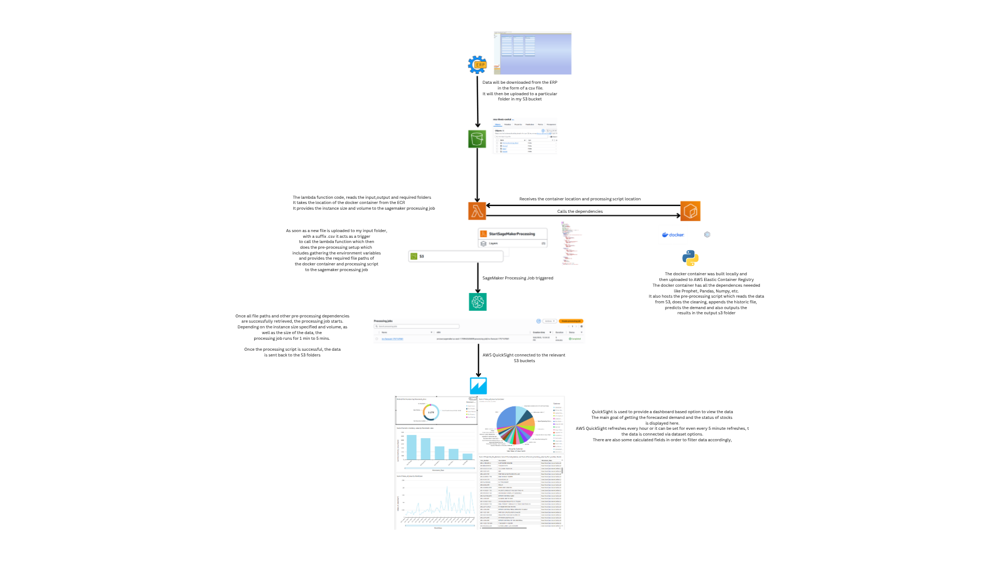

# Demand Forecasting Pipeline — AWS SageMaker & Prophet

**MSc Data Science Dissertation — Middlesex University Dubai (Feb 2026)**  
**Author:** Snehal Ashlyn D'Souza  
**Supervisor:** Dr. Ivan Reznikov  
**Grade:** Distinction

---

## Overview

An automated cloud-based inventory forecasting pipeline for spare parts management.
Upload a new stock ledger CSV to S3 and the pipeline automatically forecasts 3-month
demand and classifies stock as Fast Moving, Slow Moving or Dead Stock — no manual
intervention required.

---

## Pipeline Architecture

---

## How It Works

1. **Data Upload** — Inventory ledger exported from ERP as CSV and uploaded to S3 input folder
2. **Lambda Trigger** — S3 event notification detects new file and triggers Lambda function
3. **Docker Container** — Lambda launches SageMaker processing job using a custom Docker image hosted on ECR
4. **Forecasting** — Processing script cleans data, runs Prophet time-series model and classifies stock movement
5. **Output** — Results saved back to S3 output folder
6. **Visualisation** — AWS QuickSight connects to S3 and displays real-time interactive dashboards

---

## Stock Classification Logic

| Class       | Criteria                                       |
| ----------- | ---------------------------------------------- |
| Fast Moving | Regular movement, high monthly average         |
| Slow Moving | Irregular movement, 6+ months since last issue |
| Dead Stock  | No movement for 2+ years                       |

---

## Tech Stack

| Category    | Tools                                        |
| ----------- | -------------------------------------------- |
| Cloud       | AWS S3, Lambda, SageMaker, ECR, QuickSight   |
| Forecasting | Prophet (Meta), ARIMA, Simple Moving Average |
| Language    | Python 3.11                                  |
| Libraries   | Pandas, NumPy, Boto3, Prophet                |
| Container   | Docker                                       |
| Storage     | AWS S3                                       |

---

## Files

| File                      | Description                                      |
| ------------------------- | ------------------------------------------------ |
| `processing_script2.py`   | Main forecasting and stock classification script |
| `lambda_function.py`      | AWS Lambda trigger function                      |
| `Dockerfile`              | Docker container definition for SageMaker        |
| `images/AWS_Pipeline.png` | Full pipeline architecture diagram               |
| `poster.pdf`              | Academic research poster presented Oct 2025      |

---

## Results

- One-click automated pipeline — upload CSV, get forecast output automatically
- Prophet model forecasts 3-month demand per part using historical issue trends
- Handles seasonality, missing data and irregular demand patterns
- QuickSight dashboard auto-refreshes when new forecast data is available
- Processing time: 1–5 minutes depending on dataset size

---

## Research Poster

[View Full Research Poster](Images/poster.pdf)

---

## Future Work

- Deeper models — LSTM, XGBoost
- RAG-based chatbot for inventory queries
- Direct ERP integration for automated data extraction

---

## Certifications

- AWS Certified Machine Learning Engineering Associate (2025)
- AWS Certified AI Practitioner (2025)
- AWS Certified Cloud Practitioner (2025)

---

_University of Waterloo — BASc Mechanical Engineering (2023)_  
_Middlesex University Dubai — MSc Data Science (2026)_
